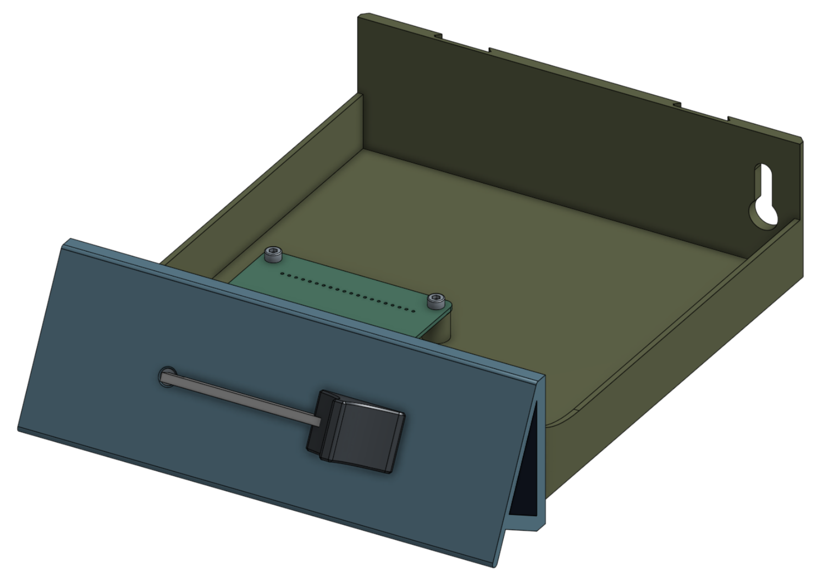

# Construction Guide

The Dial Hifi Device (DHD) is a DIY device which allows you to control the volume on your computer through a physical fader, which is mounted as the facade of a drawer for the GEN2 system. Obviously it's built with the parts that *I* have at hands, and building it for your own constraints might require to modify some things. Overall everything is open sourced: you have access to the [Onshape document](https://cad.onshape.com/documents/e0a1011ad933c9838ad313ca/w/9072f4ad6800d0c6b8320443/e/6ad28f5df8e4bbfb02ddf18f?renderMode=0&uiState=69ffd1ceabeaa0112793777b), the [KiCad schematics](https://github.com/Xowap/dhd/tree/develop/hardware/kicad) and the [Rust source code](https://github.com/Xowap/dhd) for the computer program.

{ width="500" }

## Prerequisites

In order to build this device, you will need at least some experience with 3D printing and soldering, even though I'm trying to make this as easy as possible.

### Tools

These are the tools that you will need in order to assemble the product from start to finish (let me know if I forgot something):

- Required
    - **Soldering Iron** — Used both for soldering and for heat-set inserts insertion
    - **3D Printer** — In order to print the printable parts
- Recommended
    - **Hex screwdrivers/keys** — Probably sizes 2 and/or 2.5. You can always screw using your fingers only but that's definitely not the easiest way to go.
    - **Crimping tool** — To work with the JST connectors, you will need a crimping tool. You can always work with regular pliers and cry a lot if you don't have one.
    - **Automatic Wire Stripper** — Same as above. Those wires are tiny. But if you're good with a blade...

### Commodities

You will also need to consume a few things to get going:

- **Some filament** for your 3D printer (colors up to you, any PLA is fine)
- **Flux** and **wick** for soldering
- **2.54mm PCB Pin Header** to solder the Raspberry Pi and the driver, unless they already have some in the box

## What's Next

The construction is broken into the following steps:

1. **[Bill of Materials](bom.md)** — What to buy
2. **[PCB & Soldering](pcb.md)** — Building and soldering the electronics
3. **[3D Printing](printing.md)** — Printing the enclosure parts
4. **[Physical Assembly](steps.md)** — Putting it all together
5. **[GEN2 Integration](gen2.md)** — Mounting it in a GEN2 drawer system
