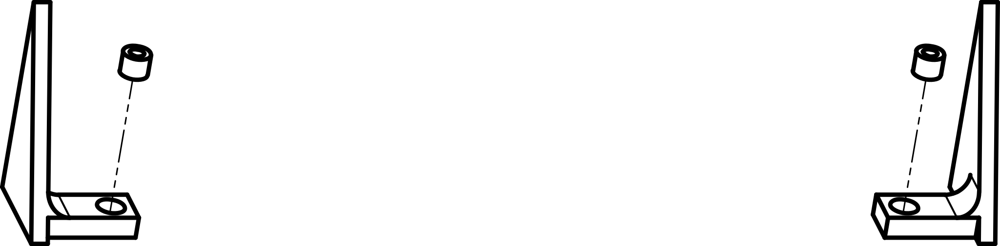
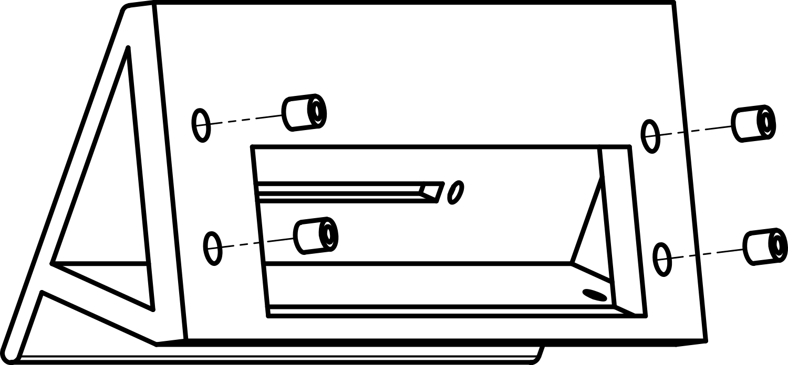
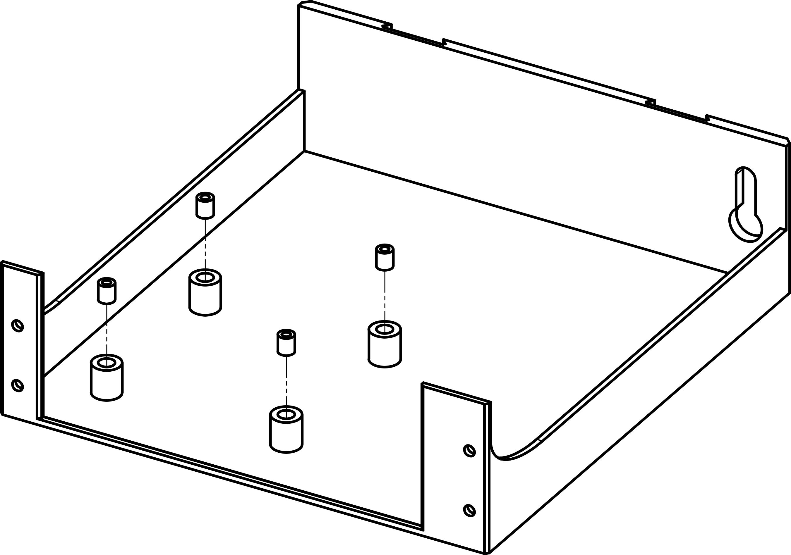
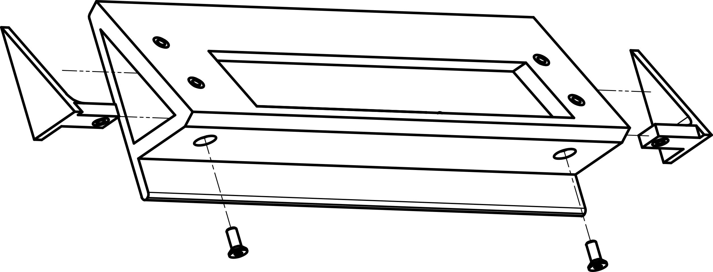
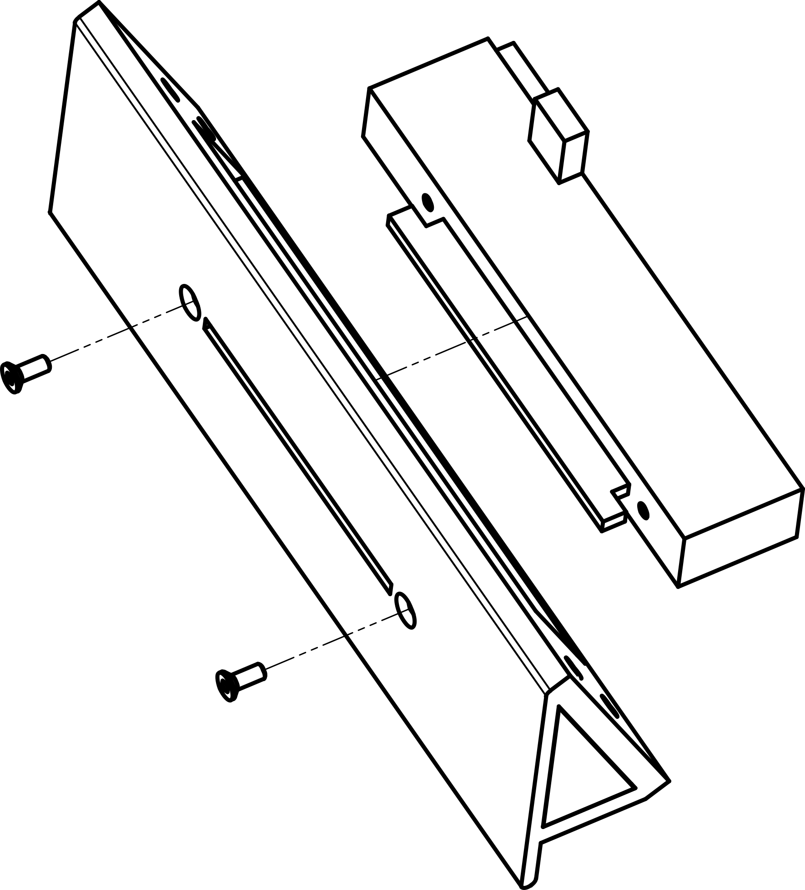
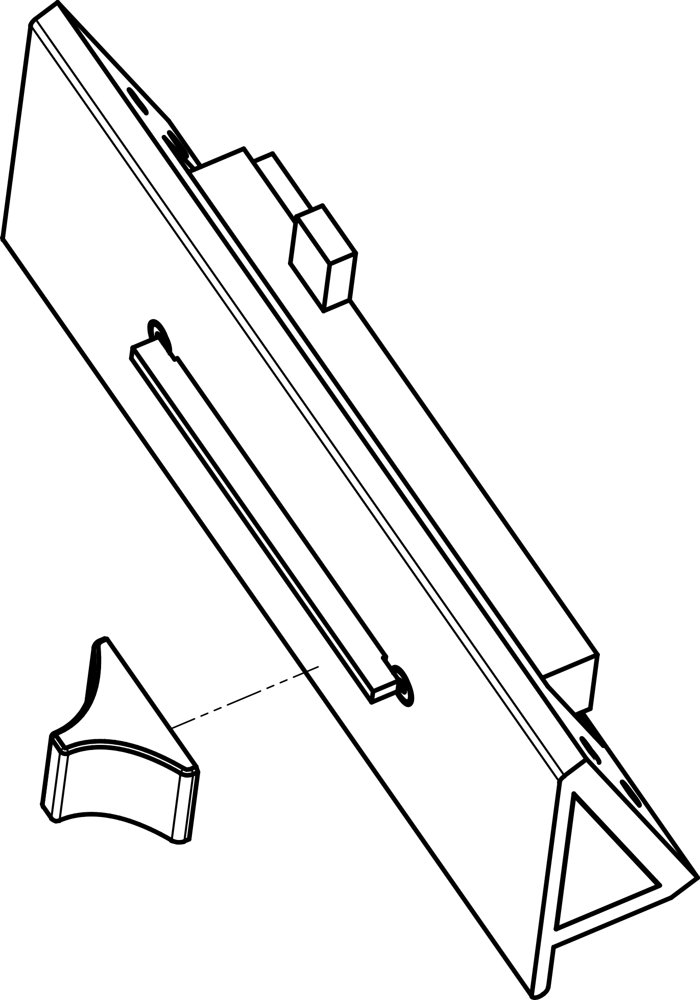
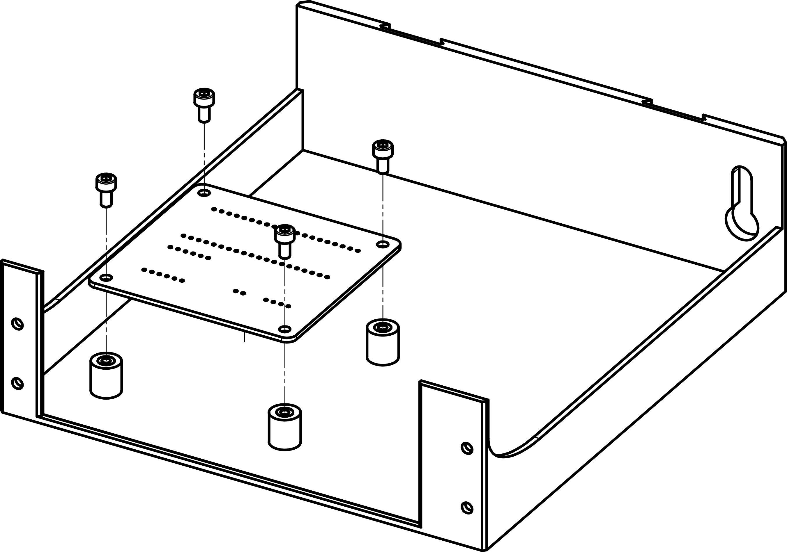
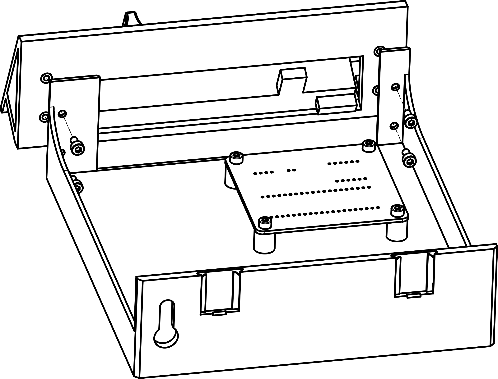

# Physical Assembly

Now is the time to assemble all that you have gathered and built.

## The BOM

Okay so to start, what should you have on your table? This list is different from the one above, as some elements already have been assembled and others have been printed.

| Item                                   | Type            | Qty  |
| -------------------------------------- | --------------- | ---- |
| Bourns PSL60                           | Motorized fader | 1    |
| 4-Pin JST-PH to JST-XH cable           | Cable           | 1    |
| M3×6 hex socket head cap screw         | Screw           | 8    |
| M3×8 hex socket countersunk head screw | Screw           | 4    |
| M3×4.0×5.0 heat-set insert             | Heat-set insert | 2    |
| M3×4.8×5.0 heat-set insert             | Heat-set insert | 4    |
| M3×5.7×5.0 heat-set insert             | Heat-set insert | 4    |
| Drawer                                 | Printed part    | 1    |
| Facade                                 | Printed part    | 1    |
| Left panel                             | Printed part    | 1    |
| Right panel                            | Printed part    | 1    |
| Knob                                   | Printed part    | 1    |
| Soldered PCB                           | PCB             | 1    |

## Phase A — Heat-set inserts

Grab your soldering iron, set it to about 50°C above printing temperature (so something like 270°C for PLA) and push the inserts into the plastic. This design is rather tolerant for different sizes of inserts, longer or shorter. Just make sure that the contact surface is flush so that the parts can be fastened closely.

### Step 1 — Insert into the panels

Push the M3×4.0×5.0 inserts into the panel's bottom holes. It can overflow in direction of the pointy end, but the bottom surface must be flush.

{ width="400" }

### Step 2 — Insert into the facade

Push the M3×4.8×5.0 inserts into the facade's back face. It can overflow inside of the facade, but the back face must be flush.

{ width="400" }

### Step 3 — Insert into the PCB support

Push the M3×5.7×5.0 inserts into the drawer's PCB support elements. If the surface isn't flush after insertion, it's not too dramatic as the PCB will be screwed in there.

{ width="400" }

## Phase B — Facade assembly

The facade is the main part of this project, and almost works as an independent module. Here we assemble its components. The next phase will essentially only be to screw it to the drawer.

### Step 4 — Screw the panels

Position the panels more or less by pushing them from the side, then when their hole is sufficiently aligned with the screw hole from below, screw them with 2 M3×8 hex socket countersunk head screws.

{ width="400" }

### Step 5 — Screw the fader

Here is represented the fader's "hitbox", which is slightly different from the actual fader, but I wasn't going to make a CAD model of it. Anyways, as you can see the socket for the potentiometer sensors is pointing up and the motor is on the left side if you look from the front. Use the other two M3×8 hex socket countersunk head screws.

{ width="400" }

### Step 6 — Attach the knob

The knob just needs to be pushed into the fader's metal slider. If you observe the metal thing close enough, you will see that two circles are pressed on each side. Inside the knob's hole you should find the negative of these shapes. Take care to insert the knob in the right direction so that the relief on one side inserts itself in the hole inside the knob. Adjustments are very tight, so you may have to use a bit of force, although nothing too dramatic. It does not exactly click, but you might feel something when it gets into position. The knob should sit about 1mm from the front face.

{ width="400" }

## Phase C — Bring it together

Now it's a simple question of connecting it all together.

### Step 7 — Screw the PCB

Be careful about the orientation of the PCB. Basically the Raspberry Pi's USB should point towards the right side, which is the side on which there is lots of space for the cable to hang. In doubt, look at the holes from the schema and line them up with what you have. Use 4 M3×6 hex socket head cap screws.

{ width="400" }

### Step 8 — Screw the facade to the drawer

Use the remaining 4 M3×6 hex socket head cap screws for this.

{ width="400" }

### Step 9 — Connect the cables

Now is time to connect the two cables that you have:

- Connect the 4 pin of the fader to the 4 pin of the PCB
- And connect the 2 pin of the motor to the 2 pin of the PCB
