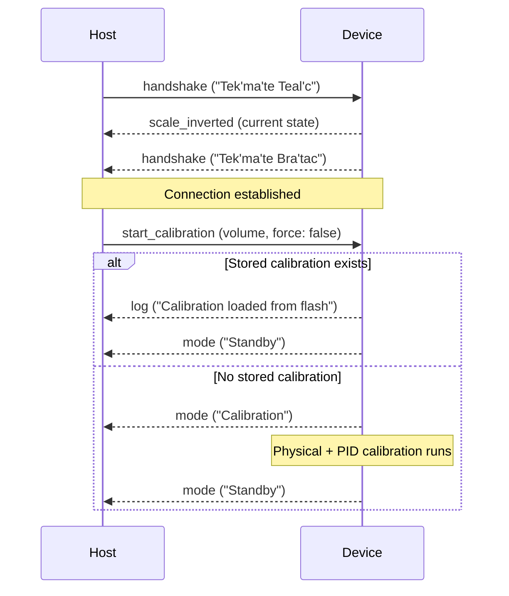
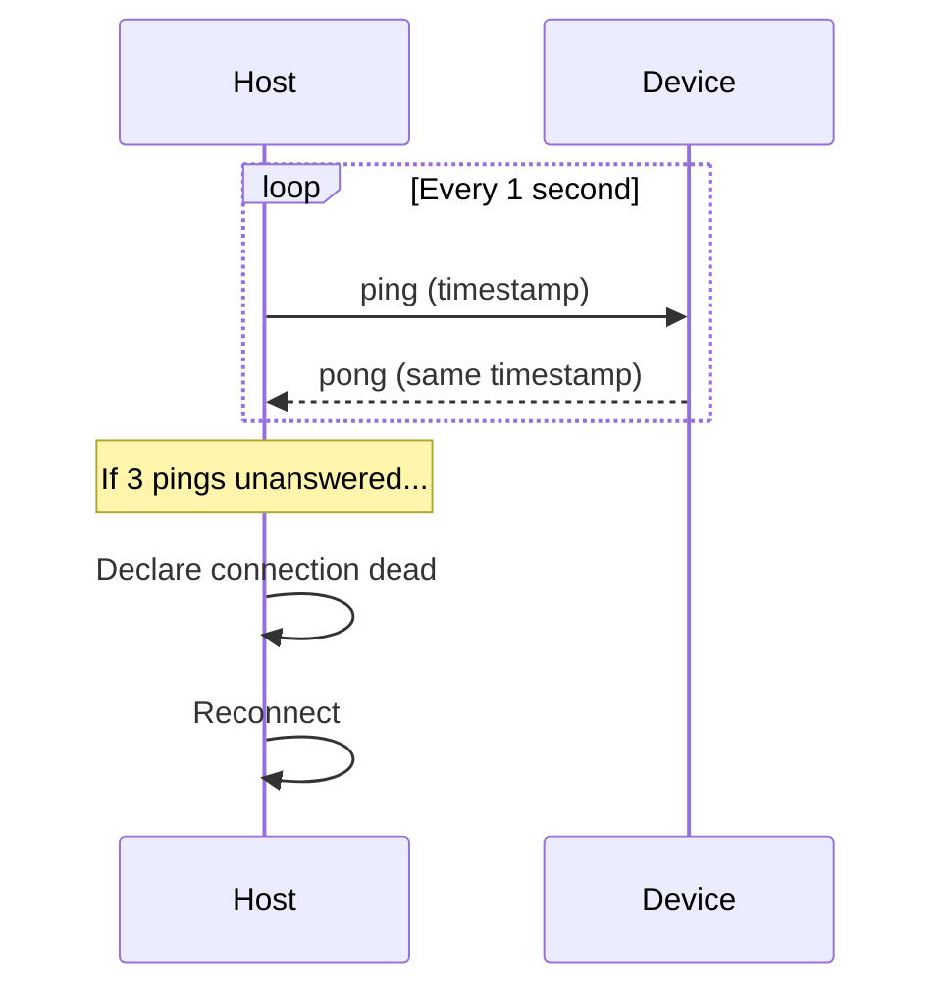
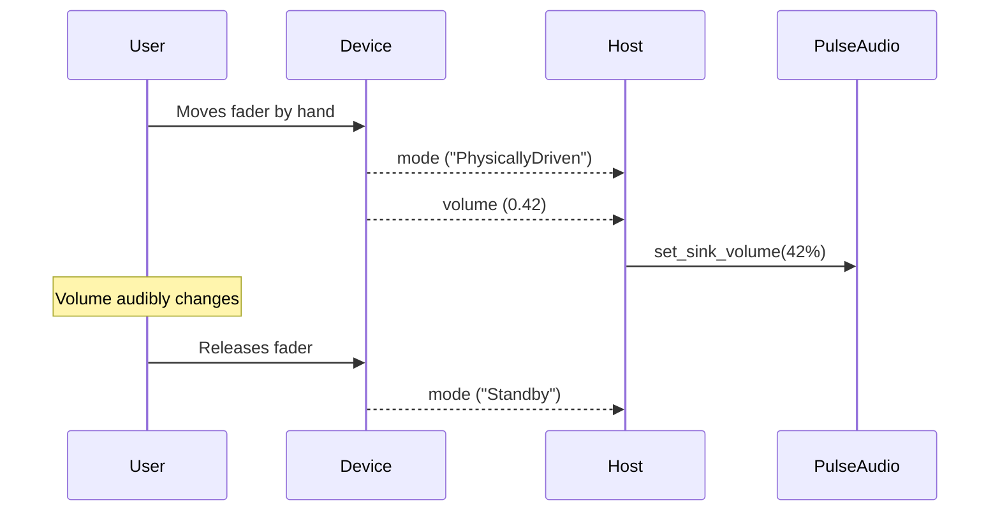
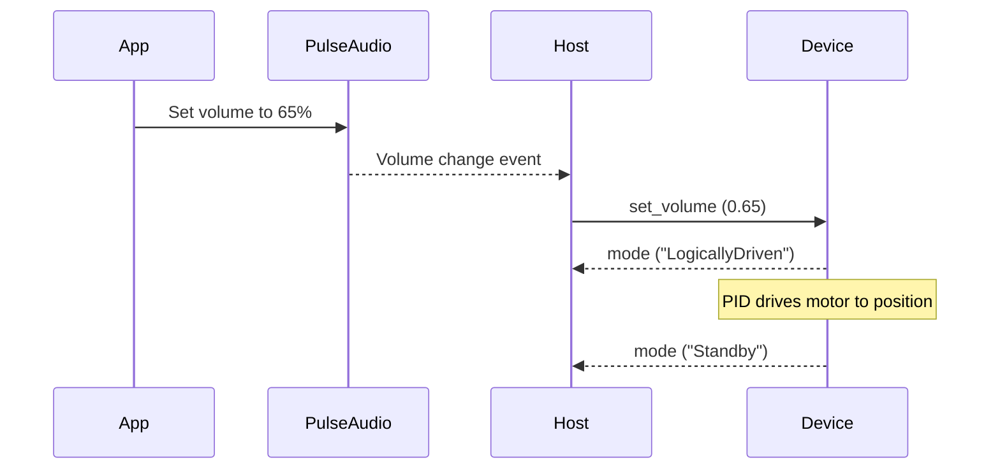
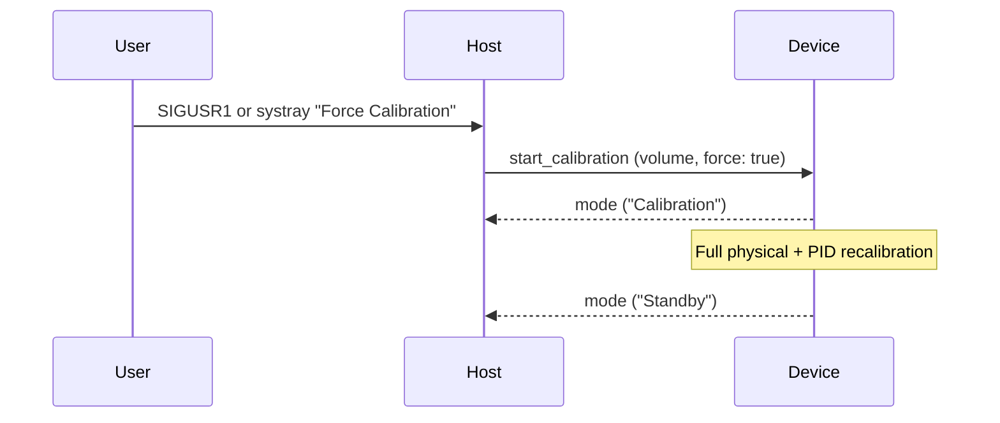
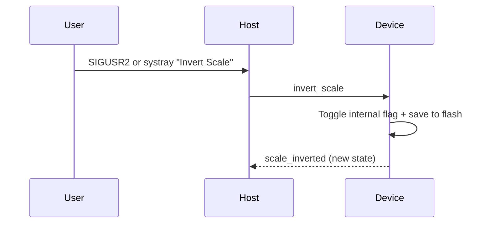

# Protocol Reference

The DHD uses a JSON-based protocol over USB CDC-ACM (virtual serial port) for
communication between firmware and host. The message types are defined in
[`common/src/lib.rs`](https://github.com/Xowap/dhd/blob/develop/common/src/lib.rs).

## Transport

| Parameter | Value |
|-----------|-------|
| Physical layer | USB 2.0 Full Speed |
| Device class | CDC-ACM |
| Baud rate | 115,200 (software-emulated) |
| Framing | Newline-delimited (`\n`) JSON objects |
| Packet size | 64 bytes (with ZLP flushing) |

---

## Messages — Host → Device

### `handshake` — Connection challenge

```json
{"handshake": {"message": "Tek'ma'te Teal'c"}}
```

| Field | Type | Description |
|-------|------|-------------|
| `message` | string (max 32) | Challenge phrase |

Sent immediately on connection. Device must reply within 2 seconds.

### `ping` — Heartbeat

```json
{"ping": {"timestamp": 1715350000000}}
```

| Field | Type | Description |
|-------|------|-------------|
| `timestamp` | u64 | Milliseconds since UNIX epoch |

Sent every 1 second. 3 missed pongs triggers reconnection.

### `start_calibration` — Trigger calibration

```json
{"start_calibration": {"volume": 0.5, "force": false}}
```

| Field | Type | Description |
|-------|------|-------------|
| `volume` | f32 (0.0–1.0) | Target position after calibration |
| `force` | bool | `true` = full recalibration regardless of stored data |

### `set_volume` — Move fader to position

```json
{"set_volume": {"value": 0.75}}
```

| Field | Type | Description |
|-------|------|-------------|
| `value` | f32 (0.0–1.0) | Target volume position |

Transitions device to `LogicallyDriven` mode.

### `update_calibration` — Manual ADC range override

```json
{"update_calibration": {"bottom": 120, "top": 3950}}
```

| Field | Type | Description |
|-------|------|-------------|
| `bottom` | u16 | Minimum raw ADC value |
| `top` | u16 | Maximum raw ADC value |

Reserved for external/diagnostic use (not sent by the current host).

### `invert_scale` — Toggle scale direction

```json
{"invert_scale": null}
```

No fields. Toggles the mapping direction (0%↔100% swap).

---

## Messages — Device → Host

### `handshake` — Identity confirmation

```json
{"handshake": {"message": "Tek'ma'te Bra'tac"}}
```

| Field | Type | Description |
|-------|------|-------------|
| `message` | string (max 32) | Response phrase |

### `pong` — Heartbeat response

```json
{"pong": {"timestamp": 1715350000000}}
```

| Field | Type | Description |
|-------|------|-------------|
| `timestamp` | u64 | Echoed from the corresponding `ping` |

### `volume` — Fader position update

```json
{"volume": {"value": 0.42}}
```

| Field | Type | Description |
|-------|------|-------------|
| `value` | f32 (0.0–1.0) | Current normalized fader position |

Only sent in `Standby` and `PhysicallyDriven` modes (prevents echo loops).

### `mode` — State change notification

```json
{"mode": {"mode": "Standby"}}
```

| Field | Type | Description |
|-------|------|-------------|
| `mode` | string | One of the system modes (see below) |

**System modes:**

| Mode | Description |
|------|-------------|
| `Init` | Device booting, awaiting handshake |
| `Calibration` | Auto-calibration in progress |
| `Standby` | Idle, waiting for input |
| `PhysicallyDriven` | User is moving the fader by hand |
| `LogicallyDriven` | Motor is moving fader to a host-requested position |
| `Failsafe` | Communication error, motor disabled |

### `log` — Diagnostic message

```json
{"log": {"level": "INFO", "message": "Calibration complete"}}
```

| Field | Type | Description |
|-------|------|-------------|
| `level` | string (max 16) | `ERROR`, `WARN`, `INFO`, `DEBUG`, or `TRACE` |
| `message` | string (max 384) | Human-readable diagnostic |

### `scale_inverted` — Inversion state report

```json
{"scale_inverted": {"inverted": true}}
```

| Field | Type | Description |
|-------|------|-------------|
| `inverted` | bool | `true` = scale is flipped |

Sent during handshake (before the response) and after each inversion toggle.

---

## Communication Sequences

### Connection & Initialization



### Health Monitoring



### Physical Volume Adjustment



### External Volume Change (Software → Hardware)



### Forced Recalibration



### Scale Inversion Toggle


