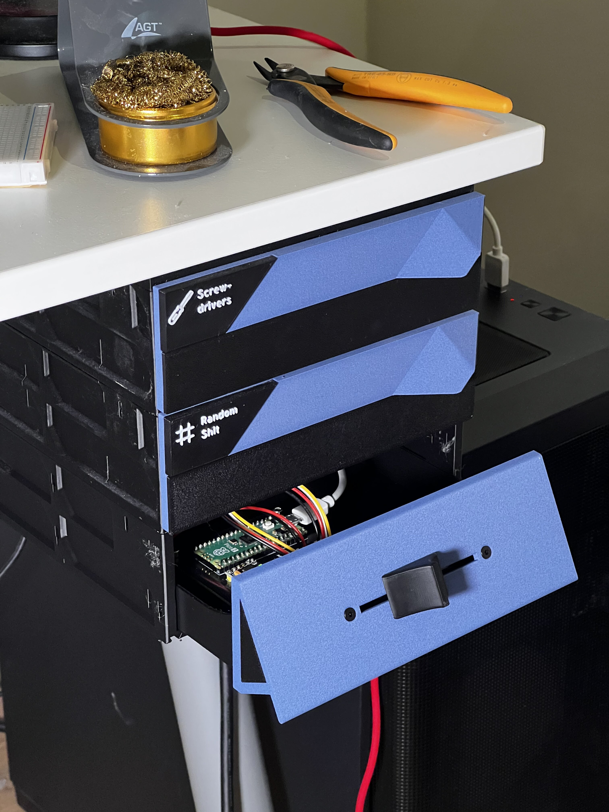
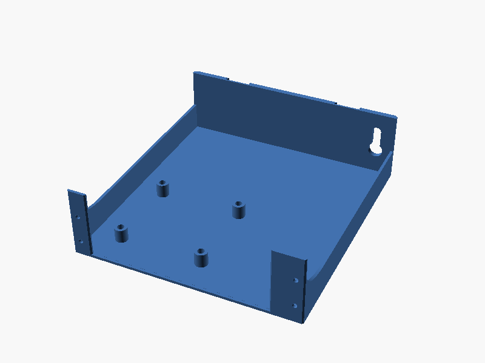
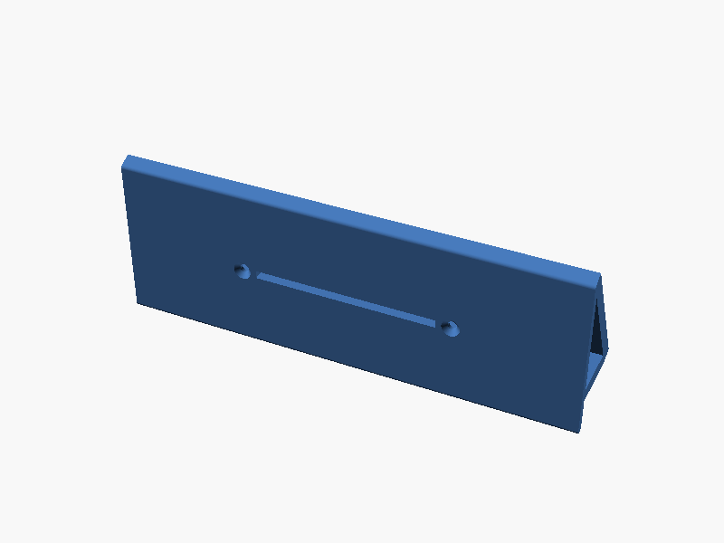
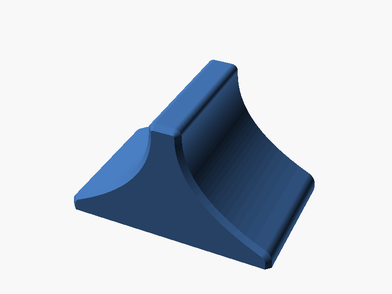
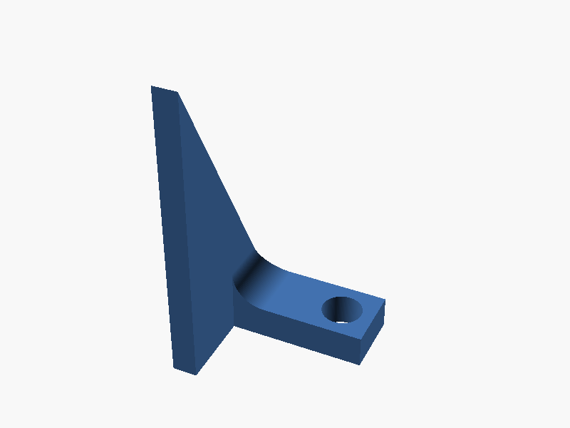

# DHD — Dial Hifi Device

<figure markdown>
  { width="600" }
  <figcaption>The DHD installed in a GEN2 drawer, open view</figcaption>
</figure>

The **Dial Hifi Device** (DHD) is a physical motorized fader that provides
seamless bidirectional volume control for your computer. Move the fader by hand
to adjust volume, or change volume from your computer and watch the fader glide
to match — like a professional mixing console on your desk.

## Key Features

- **Bidirectional control** — adjust volume physically or from software, both
  stay in sync
- **Auto-calibration** — the PID controller automatically tunes itself to your
  specific hardware
- **GEN2 drawer compatible** — mounts directly into the
  [GEN2 modular system](https://www.jerrari3d.com/gen2-modular-system), no need
  to reinvent a fixation system
- **Fully open source** — hardware (KiCad + STL), firmware (Rust/Embassy), and
  host software (Rust/Tokio) are all available

## How It Works

The system uses a **Bourns PSL60 motorized fader** driven by a **DRV8833 motor
driver**, controlled by a **Raspberry Pi Pico 2** running an Embassy async
firmware. A PID controller with automatic calibration handles precise motor
positioning. The host daemon on Linux integrates with PulseAudio/PipeWire via a
JSON-over-USB protocol.

## Getting Started

Ready to build one? Head to the [Assembly Guide](assembly/index.md) to get
started.

Already assembled? Check the [Host Software](host/installation.md) section to
set up the Linux daemon.

## 3D Printed Parts

All parts are designed for the GEN2 modular drawer system:

- 

    **Drawer**

    The base structure and GEN2 compatibility layer.

    [:octicons-download-16: Download STL](https://github.com/Xowap/dhd/raw/master/hardware/stl/DHD_Drawer.stl)

- 

    **Facade**

    The main component holding the fader.

    [:octicons-download-16: Download STL](https://github.com/Xowap/dhd/raw/master/hardware/stl/DHD_Facade.stl)

- 

    **Knob**

    Studio-style knob for comfortable control.

    [:octicons-download-16: Download STL](https://github.com/Xowap/dhd/raw/master/hardware/stl/DHD_Knob.stl)

- 

    **Side Panels**

    Cosmetic panels to close off the sides.

    [:octicons-download-16: Left](https://github.com/Xowap/dhd/raw/master/hardware/stl/DHD_Panel_Left.stl) ·
    [:octicons-download-16: Right](https://github.com/Xowap/dhd/raw/master/hardware/stl/DHD_Panel_Right.stl)

