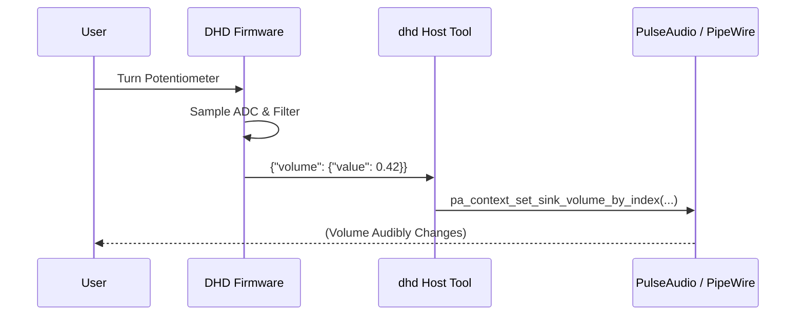
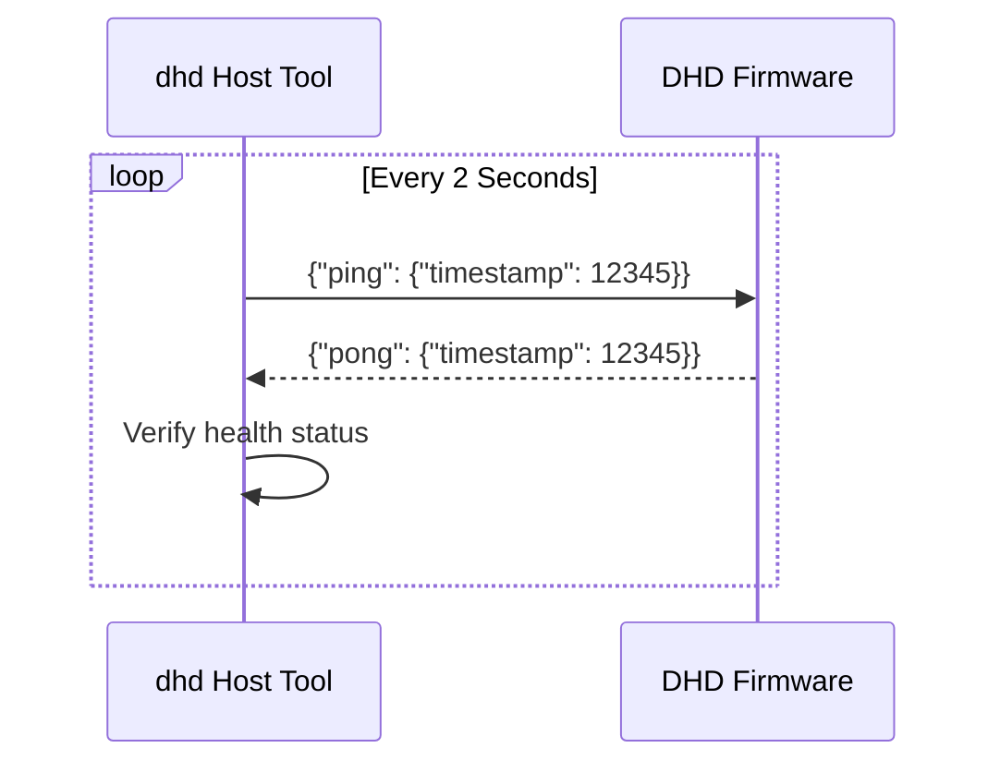
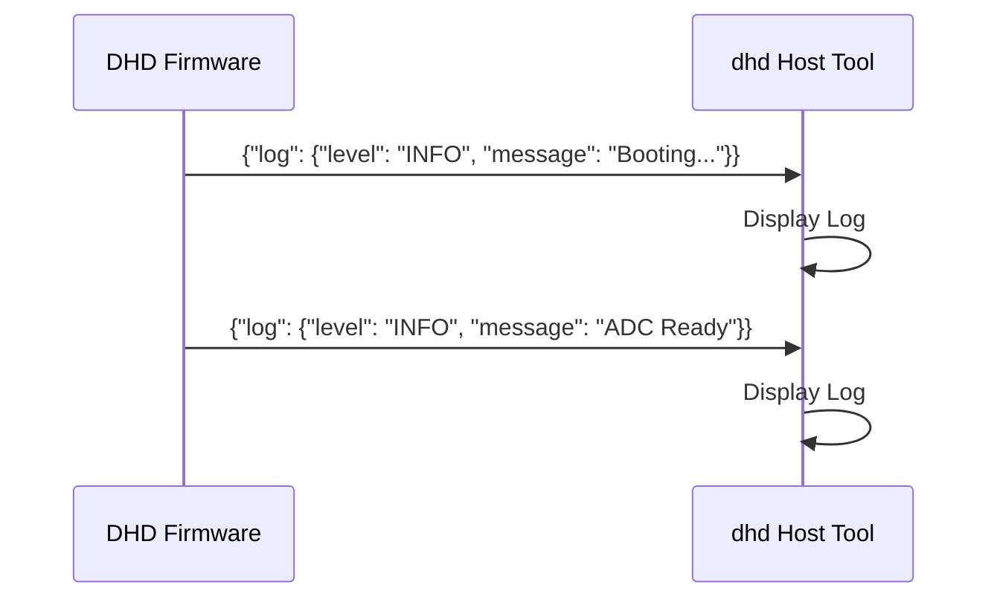

# DHD Protocol Specification

The Dial Hifi Device (DHD) uses a JSON-based protocol over a CDC-ACM (Virtual Serial) link to communicate between the firmware and the host daemon.

## Transport Layer

- **Physical Layer**: USB 2.0 (Full Speed)
- **Class**: CDC-ACM
- **Baud Rate**: 115,200 (Software-emulated)
- **Framing**: Newline-delimited (`\n`) JSON objects.

## Data Frames

### 1. Volume Update (`volume`)
Sent from **Device → Host** when the physical potentiometer position changes significantly.

- **Payload**:
  ```json
  {"volume": {"value": 0.752}}
  ```
- **Range**: `0.0` to `1.0` (f32)
- **System Impact**: The host daemon maps this value linearly to the default PulseAudio sink's volume (0% to 100%).

### 2. Log Message (`log`)
Sent from **Device → Host** for diagnostic purposes.

- **Payload**:
  ```json
  {"log": {"level": "INFO", "message": "ADC calibration complete"}}
  ```
- **Levels**: `INFO`, `WARN`, `ERROR`
- **System Impact**: Displayed in the host terminal with appropriate color coding.

### 3. Ping (`ping`)
Sent from **Host → Device** every 2 seconds to verify the connection health.

- **Payload**:
  ```json
  {"ping": {"timestamp": 1711468800000}}
  ```
- **System Impact**: The device must respond immediately with a `pong`.

### 4. Pong (`pong`)
Sent from **Device → Host** in response to a `ping`.

- **Payload**:
  ```json
  {"pong": {"timestamp": 1711468800000}}
  ```
- **System Impact**: The host verifies that the timestamp matches the last sent `ping` to confirm the round-trip link is healthy.

## Communication Sequences

### Volume Adjustment
When the user turns the dial, the device sends updates. The host maps these directly to the system's audio interface.



### Health Monitoring (Heartbeat)
The host ensures the device is still responsive.



### Initialization & Logging
On boot, the device sends its status to the host.


