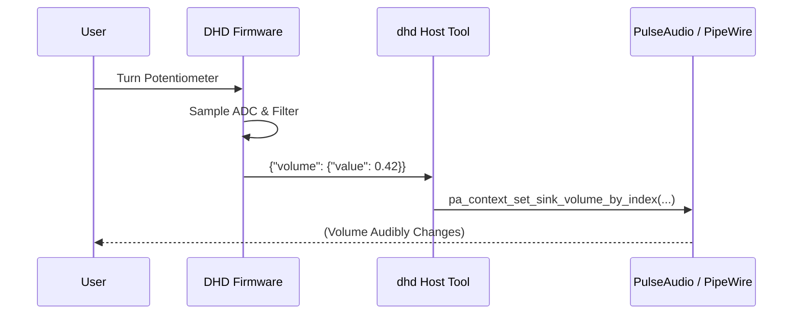
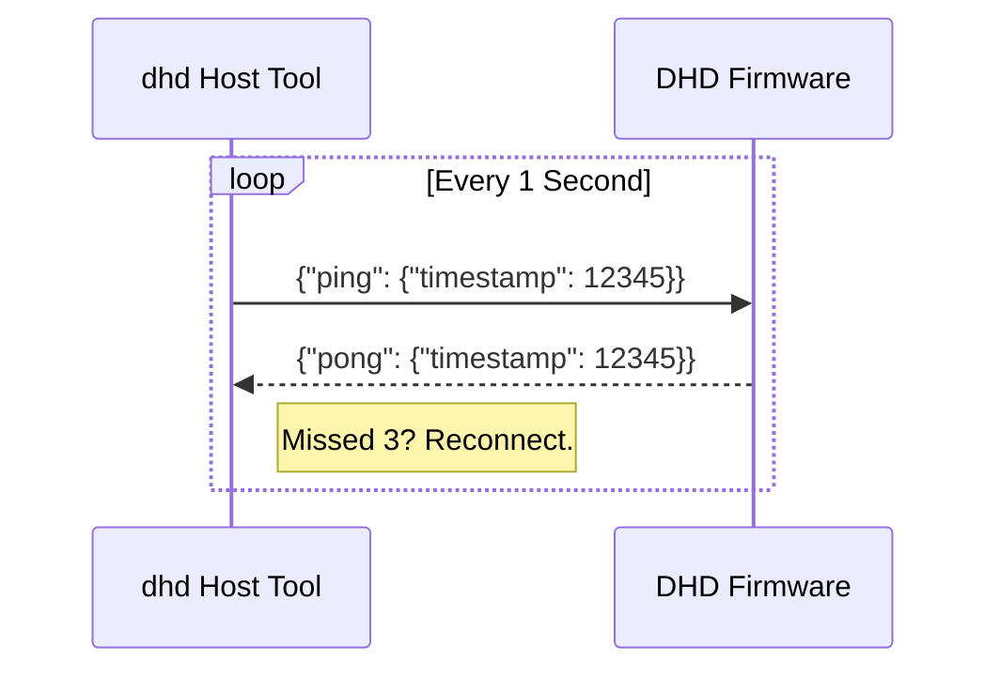
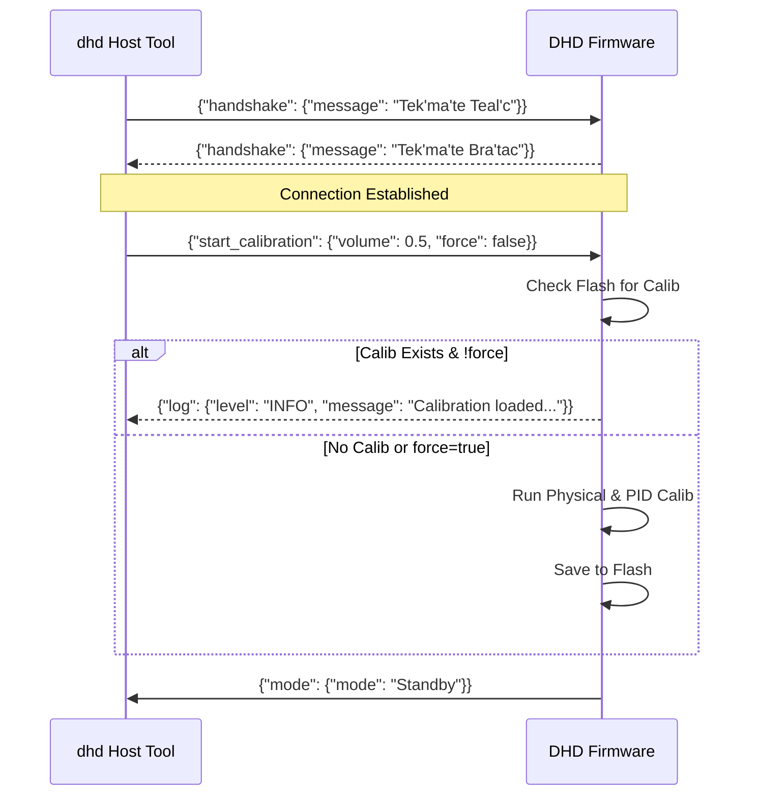

# DHD Protocol Specification

The Dial Hifi Device (DHD) uses a JSON-based protocol over a CDC-ACM (Virtual
Serial) link to communicate between the firmware and the host daemon.

## Transport Layer

- **Physical Layer**: USB 2.0 (Full Speed)
- **Class**: CDC-ACM
- **Baud Rate**: 115,200 (Software-emulated)
- **Framing**: Newline-delimited (`\n`) JSON objects.

## Data Frames

### 1. Volume Update (`volume`)

Sent from **Device → Host** when the physical potentiometer position changes
significantly.

- **Payload**:
    ```json
    { "volume": { "value": 0.752 } }
    ```
- **Range**: `0.0` to `1.0` (f32)
- **System Impact**: The host daemon maps this value linearly to the default
  PulseAudio sink's volume (0% to 100%).

### 2. Log Message (`log`)

Sent from **Device → Host** for diagnostic purposes.

- **Payload**:
    ```json
    { "log": { "level": "INFO", "message": "ADC calibration complete" } }
    ```
- **Levels**: `INFO`, `WARN`, `ERROR`
- **System Impact**: Displayed in the host terminal with appropriate color
  coding.

### 3. Handshake (`handshake`)

Sent from **Host → Device** immediately after connection to verify the device
type and firmware version.

- **Payload**:
    ```json
    { "handshake": { "message": "Tek'ma'te Teal'c" } }
    ```
- **System Impact**: The device must respond with the correct reply message to
  confirm its identity. If the host does not receive the expected reply within 2
  seconds, it will disconnect and retry.

### 4. Handshake Response (`handshake`)

Sent from **Device → Host** in response to a host handshake challenge.

- **Payload**:
    ```json
    { "handshake": { "message": "Tek'ma'te Bra'tac" } }
    ```
- **System Impact**: Completes the initial connection phase and allows the host
  to start processing volume and log messages.

### 5. Ping (`ping`)

Sent from **Host → Device** every 1 second to verify the connection health.

- **Payload**:
    ```json
    { "ping": { "timestamp": 1711468800000 } }
    ```
- **System Impact**: The device must respond immediately with a `pong`. If the
  host misses 3 consecutive pings (3 seconds total), it considers the connection
  dead and initiates a reconnection.

### 6. Pong (`pong`)

Sent from **Device → Host** in response to a `ping`.

- **Payload**:
    ```json
    { "pong": { "timestamp": 1711468800000 } }
    ```
- **System Impact**: The host verifies that the timestamp matches the last sent
  `ping` to confirm the round-trip link is healthy. Successful pong resets the
  "missed pings" counter to 0.

### 7. Start Calibration (`start_calibration`)

Sent from **Host → Device** to trigger the auto-calibration routine.

- **Payload**:
    ```json
    { "start_calibration": { "volume": 0.5, "force": false } }
    ```
- **Fields**:
    - `volume`: Initial volume to set after calibration completes.
    - `force` (optional, default: `false`): If `true`, forces a full physical
      and PID re-calibration. If `false`, the device will skip calibration if
      valid parameters are already stored in flash.
- **System Impact**: Transitions the device to `Calibration` mode.

### 8. Set Volume (`set_volume`)

Sent from **Host → Device** to move the fader to a specific logical position.

- **Payload**:
    ```json
    { "set_volume": { "value": 0.8 } }
    ```
- **System Impact**: Transitions the device to `LogicallyDriven` mode.

### 9. Mode Update (`mode`)

Sent from **Device → Host** to report a change in the system mode.

- **Payload**:
    ```json
    { "mode": { "mode": "Standby" } }
    ```
- **Modes**: `Init`, `Calibration`, `Standby`, `Failsafe`, `PhysicallyDriven`,
  `LogicallyDriven`
- **System Impact**: Allows the host to track the current operational state of
  the device.

### 10. Update Calibration (`update_calibration`)

Sent from **Host → Device** to manually update the potentiometer calibration
range.

- **Payload**:
    ```json
    { "update_calibration": { "bottom": 100, "top": 4000 } }
    ```
- **Fields**:
    - `bottom`: The new minimum raw ADC value.
    - `top`: The new maximum raw ADC value.
- **System Impact**: The device updates its physical boundaries and applies the
  new range immediately.

## Communication Sequences

### Volume Adjustment

When the user turns the dial, the device sends updates. The host maps these
directly to the system's audio interface.



### Health Monitoring (Heartbeat)

The host ensures the device is still responsive.



### Initialization & Handshake

On boot and connection, the host and device perform a handshake, followed by an
optional calibration request from the host.


